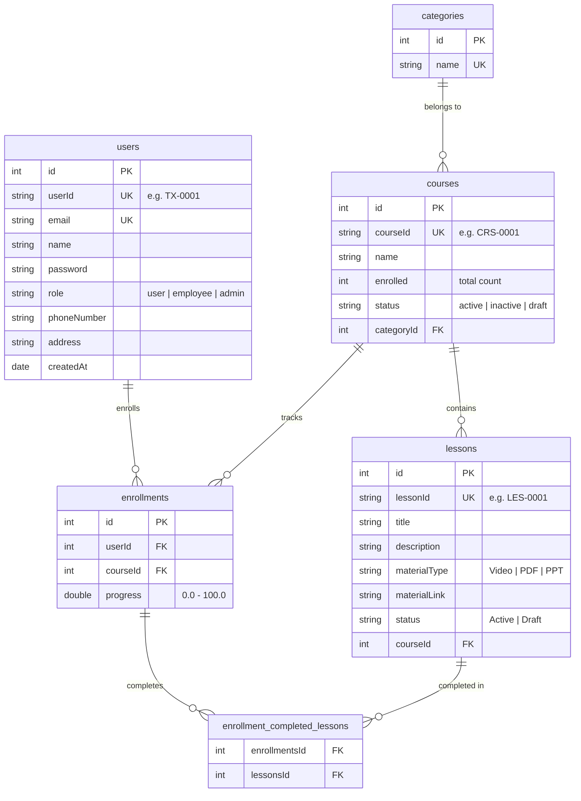

# TrainXcel Backend API

TrainXcel is a robust, production-ready Learning & Training Management System (LMS) backend built with **NestJS**, **TypeORM**, and **PostgreSQL** (Neon DB). 

It features secure session-based authentication using **JWT inside HTTP-only cookies**, automated human-readable sequential custom IDs, course category tracking, enrollment progress calculations, and a comprehensive suite of manager dashboards and analytics.

---

## 🚀 Aim & Key Features

* **Secure Authentication**: HTTP-only cookie delivery prevents XSS token theft.
* **Unified Custom IDs**: Uses auto-incremented string codes for public facing resources (`TX-XXXX` for Users, `CRS-XXXX` for Courses, `LES-XXXX` for Lessons) while keeping internal numeric database keys private.
* **Enrollment & Progress engine**: Tracks completed lessons and calculates real-time course progress rates ($0\% - 100\%$) and overall course completion rates dynamically.
* **Analytics & Graphs data**: Endpoints ready to plug straight into charts (monthly progress curves, comparative bar charts, leaderboards, at-risk user alerts, recent activity feed).
* **Automatic Database Seeding**: Generates comprehensive mock data (3 users, 3 categories, 4 courses, 13 lessons, 5 progress profiles) on initial boot to verify features immediately.

---

## 🗄️ Database Structure

Below is the entity relation structure mapping the PostgreSQL normalized tables:



---

## 🛠️ Environment Configuration

Create a `.env` file in the root of the project:

```env
DATABASE_URL="postgresql://[user]:[password]@[host]/[database]?sslmode=require"
PORT=3000
JWT_SECRET=your_cryptographically_secure_random_key_here
```

---

## 🏃 Running the Application

1. **Install dependencies**:
   ```bash
   npm install
   ```
2. **Build the production bundle**:
   ```bash
   npm run build
   ```
3. **Run the development server**:
   ```bash
   npm run start:dev
   ```
   *The application starts running on `http://localhost:3000`.*
   *On first boot, the database schema synchronizes and automatically seeds the default users and test courses.*

---

## 📡 API Endpoints Reference

### 1. Authentication & Sessions (Protected routes require logged in Cookie)

| Method | Endpoint | Description | Payload Body / Params | Expected Response |
| :--- | :--- | :--- | :--- | :--- |
| **POST** | `/auth/register` | Register a new profile | `{"email": "...", "name": "...", "password": "...", "role": "user"}` | `{"id": 1, "userId": "TX-0004", "email": "...", ...}` *(Sets HTTP-Only Cookie)* |
| **POST** | `/auth/login` | Log into an existing profile | `{"email": "...", "password": "..."}` | `{"id": 1, "userId": "TX-0001", "email": "...", ...}` *(Sets HTTP-Only Cookie)* |
| **POST** | `/auth/logout` | Log out of the session | *(Empty)* | `{"message": "Logged out successfully"}` *(Clears Cookie)* |
| **GET** | `/auth/profile` | Get own profile details | *(Reads from cookie)* | `{"userId": "TX-0001", "name": "Jane", "phoneNumber": "..."}` |
| **PATCH** | `/auth/users/:userId` | Update profile fields | `{"name": "Jane Doe", "phoneNumber": "555-0100"}` | Updated user profile object |
| **PATCH** | `/auth/users/:userId/role` | Update role (Admin Only) | `{"role": "employee"}` | Updated user profile object |

### 2. Search Engine
* **Unified Search (Courses & Employees)**: `GET /courses/search/unified?q=term`
  * *Returns: `{"courses": [...], "employees": [...]}`*
* **Courses Only**: `GET /courses/search?q=term`
* **Users Only**: `GET /auth/users/search?q=term`

### 3. Course & Lesson Management (Requires Admin / Employee Cookie)
* **Create Course**: `POST /courses`
  * Body: `{"name": "Next.js Architecture", "categoryId": 1, "status": "draft"}`
* **Update Course**: `PATCH /courses/:courseId`
  * Body: `{"name": "Next.js Pro Guide", "status": "active"}`
* **Add Lesson**: `POST /courses/:courseId/lessons`
  * Body: `{"title": "App Router", "materialType": "Video", "materialLink": "http://...", "status": "Active"}`
* **Update Lesson**: `PATCH /courses/:courseId/lessons/:lessonId`
  * Body: `{"title": "Static Pages", "materialType": "PDF"}`

### 4. Course Enrollment & Lesson Progress
* **Enroll in Course**: `POST /courses/:courseId/enroll`
  * *Body: (Empty - automatically detects logged-in user)*
* **Mark Lesson Complete**: `POST /courses/:courseId/lessons/:lessonId/complete`
  * *Body: (Empty - automatically registers completion & increments progress rate)*
* **Get Progress Rate**: `GET /courses/:courseId/progress/:userId`

### 5. Statistics, Graph Data & Analytics Leaderboards
* **Overall Metrics Overview**: `GET /courses/stats/dashboard`
  * *Returns: `{"totalUsers": 5, "totalCourses": 4, "totalEmployees": 1, "overallCompletionRate": 63.33}`*
* **Monthly User Progress Trend (UI Graph)**: `GET /courses/stats/monthly-progress`
* **Course Progress Comparison (UI Graph)**: `GET /courses/stats/course-progress-comparison`
* **Category Performance Rankings**: `GET /courses/stats/categories`
* **Material Engagement Analysis**: `GET /courses/stats/materials`
* **At-Risk Learners Alert**: `GET /courses/stats/at-risk`
* **Recent Activity Feed**: `GET /courses/stats/recent-activity`

---

## 🔌 Frontend Connection Guidelines

Because authentication uses secure **HTTP-Only Cookies**, web browsers protect and manage the token automatically. When connecting your frontend application (e.g. React, Next.js, Vue), follow these guidelines:

### 1. Enable Credentials (CORS)
To allow cookies to pass between different origins (e.g. frontend running on `http://localhost:3000` and backend on `http://localhost:5000`):
* Make sure `cors` is enabled in `main.ts` with `credentials: true`:
  ```typescript
  app.enableCors({
    origin: 'http://localhost:3000', // Your frontend URL
    credentials: true,
  });
  ```

### 2. Configure HTTP Requests in Frontend

* **Using fetch API**:
  You **must** supply `credentials: 'include'` on all fetch requests:
  ```javascript
  fetch('http://localhost:3000/auth/profile', {
    method: 'GET',
    credentials: 'include', // Tells the browser to transmit the HTTP-only cookie
  });
  ```

* **Using Axios**:
  Configure your Axios client or instance to include credentials globally:
  ```javascript
  import axios from 'axios';

  const api = axios.create({
    baseURL: 'http://localhost:3000',
    withCredentials: true, // Automatically sends cookies on all requests
  });
  ```
